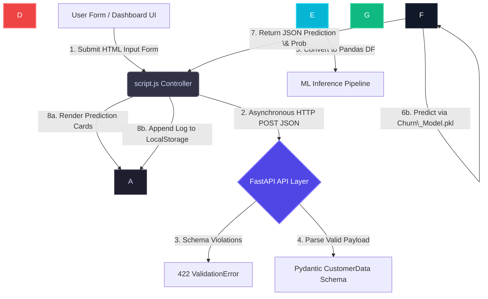

# ChurnOptix AI

### *Enterprise Telecom Customer Retention \& Predictive Intelligence Platform*

[!\[FastAPI](https://img.shields.io/badge/FastAPI-005571?style=for-the-badge\&logo=fastapi)](https://fastapi.tiangolo.com)
[!\[Scikit-Learn](https://img.shields.io/badge/scikit--learn-%23F7931E.svg?style=for-the-badge\&logo=scikit-learn\&logoColor=white)](https://scikit-learn.org/)
[!\[Chart.js](https://img.shields.io/badge/chart.js-F5788D.svg?style=for-the-badge\&logo=chart.js\&logoColor=white)](https://www.chartjs.org/)
[!\[JavaScript](https://img.shields.io/badge/javascript-%23323330.svg?style=for-the-badge\&logo=javascript\&logoColor=%23F7DF1E)](https://developer.mozilla.org/en-US/docs/Web/JavaScript)
[!\[License: MIT](https://img.shields.io/badge/License-MIT-yellow.svg?style=for-the-badge)](https://opensource.org/licenses/MIT)

\---

## 1\. Overview

In the highly competitive telecommunications industry, customer churn is one of the most significant drains on operating margin and capital efficiency. Acquiring a new customer is five to twenty-five times more expensive than retaining an existing one. High churn rates directly erode customer lifetime value (LTV), inflate customer acquisition costs (CAC), and compress profit margins. **ChurnOptix AI** solves this critical business problem by transforming raw, multi-dimensional customer data into high-fidelity, real-time retention intelligence.

Our solution targets customer success teams, retention managers, marketing operations analysts, and corporate executives who require granular, predictive insight into subscriber loyalty. By delivering precise, individual-level risk probabilities rather than generic aggregate segments, ChurnOptix AI empowers front-line customer success representatives to intervene with tailored retention incentives before a subscriber decides to terminate their service.

The platform utilizes advanced machine learning (specifically an ensemble Random Forest model) to discover non-linear relationships across a customer's contract terms, service subscriptions, tenure, and billing details. Unlike typical "black-box" models, ChurnOptix AI balances predictive accuracy with transparency by outputting local risk attributions. This ensures that every prediction is accompanied by a concrete, human-readable reason (e.g., month-to-month contract vulnerability combined with a lack of technical support services), giving retention agents the context they need to make meaningful offers.

Key differentiators of ChurnOptix AI include its dual-mode operations—providing real-time inference via a lightweight FastAPI REST API alongside a client-side behavioral simulation fallback—and a premium, distraction-free analytical user interface. The entire application is built on a high-performance stack requiring zero build steps or heavy framework overhead, ensuring fast load times, minimal runtime dependencies, and straightforward enterprise deployment.

\---

## 2\. Key Features

* **Real-Time Churn Inference Engine**: A production-ready FastAPI endpoint that ingests customer profiles and outputs precise churn risk percentages and classifications in milliseconds.
* **Explainable AI (XAI)**: Locally attributed feature importance that highlights the primary drivers (e.g., tenure, payment method, contract type) behind an individual's churn prediction, enabling targeted interventions.
* **Interactive Decision Dashboard**: A responsive, browser-based workspace featuring real-time KPI indicators, interactive Chart.js visualizations, and dynamic risk distribution tracking.
* **Structured Customer Profiling**: An intuitive prediction interface that allows agents to load saved customer profiles, modify parameters on the fly, and simulate changes in churn risk (e.g., how risk drops when upgrading from a monthly to a one-year contract).
* **Persistent Prediction Audit Log**: A local storage-based history log with complete sorting, pagination, and filtering capabilities, creating a local audit trail of all evaluations.
* **Adaptive Rule Engine Fallback**: A client-side heuristic simulation engine that seamlessly mimics the machine learning model's behavior during temporary network disruptions, ensuring zero customer success downtime.
* **Robust Preprocessing Pipeline**: A pre-fit Scikit-Learn `ColumnTransformer` that automates ordinal encoding and standard scaling, guaranteeing exact alignment between raw API inputs and model expectations.

\---

## 3\. Technology Stack

### Frontend

* **HTML5 \& CSS3 (Vanilla)**: Structured semantic markup and a bespoke design system built using CSS Custom Properties. The interface utilizes fluid layouts, custom-tuned dark/light modes, glassmorphism card panels, and smooth CSS transitions.
* **JavaScript (ES6+)**: Custom reactive state management, asynchronous fetch interfaces for backend API communication, and dynamic DOM manipulation logic.
* **Chart.js**: Leveraged for hardware-accelerated, responsive client-side data visualizations (pie charts, line graphs, bar charts) displaying historical trends and risk statistics.
* **Typography \& Iconography**: Outfit (for modern headers) and Plus Jakarta Sans (for highly readable body copy) sourced via Google Fonts, with vector icons supplied by FontAwesome.
* *Why Selected*: Minimizes browser loading times, eliminates framework churn, simplifies repository maintenance, and provides maximum control over styling and UI rendering.

### Backend

* **FastAPI**: A high-performance, asynchronous web framework built on Python 3.8+ for designing APIs.
* **Uvicorn**: An ultra-fast ASGI web server implementation used to host the FastAPI application.
* **Pydantic (v2)**: Performs strict runtime data validation and serialization. It translates incoming JSON payloads into type-safe Python objects, returning standard `422 Unprocessable Entity` responses if inputs are malformed.
* **Joblib**: Used for the low-overhead serialization and deserialization of the trained machine learning estimator and preprocessing pipelines.
* *Why Selected*: FastAPI offers developer-friendly auto-generated OpenAPI documentation (`/docs`) alongside near-Go execution speeds, making it ideal for microservice integration.

### Data Science \& Machine Learning

* **Scikit-Learn**: The core framework used to implement preprocessing pipelines, baseline estimators (Logistic Regression), and the final Random Forest classifier.
* **Pandas \& NumPy**: Utilized for exploratory data analysis (EDA), data cleaning, matrix transformations, and restructuring tabular data.
* **Matplotlib \& Seaborn**: Employed to generate static diagnostic plots, including confusion matrices, ROC curves, and global feature importance charts.
* *Why Selected*: Python's standard ML stack provides stable, optimized, C-accelerated implementations of data processing routines and classical machine learning algorithms.

### Database Architecture

* **State \& Session Persistence**: Leverages HTML5 `LocalStorage` on the client side to store prediction history log arrays, configuration states, and user preferences (such as light/dark theme switches).
* **File-Based Storage**: Intermediate datasets (`cleaned\_churn\_data.csv`, `processed\_churn\_data.csv`) are written to the local disk under the `data/` directory to simplify MLOps file tracking.

### Deployment \& Infrastructure

* **Frontend**: Designed to run on lightweight, edge-optimized static hosting platforms such as **GitHub Pages**, Vercel, or Netlify.
* **Backend**: Deployed to containerized or cloud PaaS platforms like **Render**, Railway, or AWS Elastic Beanstalk.
* **Version Control**: GitHub manages the repository, tracking both codebase adjustments and serialized binary versions of the model pipeline.

\---

## 4\. Machine Learning Methodology

The machine learning lifecycle of ChurnOptix AI is engineered to produce reproducible, high-performing, and explainable models.

```
\[Raw Data] ➔ \[Data Cleaning] ➔ \[ColumnTransformer Preprocessing] ➔ \[Train/Test Split] ➔ \[Model Selection] ➔ \[Serialized Artifacts]
```

### Data Collection

The model was trained on the industry-standard **IBM Telco Customer Churn Dataset**, containing 7,043 subscriber records. Each row represents a unique customer and includes 21 features capturing demographic data, subscribed services, account details, and billing history.

### Data Cleaning

* **Identifier Removal**: The `customerID` feature was removed as it has no predictive power and prevents model generalization.
* **Type Casting**: The `TotalCharges` feature, initially read as a text column due to empty spaces (which represent brand-new subscribers with 0 months of tenure), was cast to numeric. The blank values were replaced with `0` to reflect actual billing state.
* **Imputation**: Any remaining missing data in `TotalCharges` was imputed using the column's median value calculated from the training set.
* **Target Mapping**: The target feature `Churn` ("Yes"/"No") was mapped to binary values (`1` and `0` respectively).

### Feature Engineering \& Preprocessing

To prevent data leakage, preprocessing parameters were fitted solely on the training partition and then applied to the test partition. We constructed a centralized `ColumnTransformer` with two primary pipelines:

1. **Categorical features** (`gender`, `Partner`, `Dependents`, `PhoneService`, `MultipleLines`, `InternetService`, `OnlineSecurity`, `OnlineBackup`, `DeviceProtection`, `TechSupport`, `StreamingTV`, `StreamingMovies`, `Contract`, `PaperlessBilling`, `PaymentMethod`) were encoded using an `OrdinalEncoder`. It maps unseen categorical values in future inference requests to a default value of `-1`.
2. **Numerical features** (`tenure`, `MonthlyCharges`, `TotalCharges`) were normalized using a `StandardScaler`. This scales features to have a mean of 0 and a variance of 1, which is critical for distance-based and linear models.

### Model Development \& Selection

We trained and compared two distinct classifiers:

1. **Logistic Regression (Baseline)**: A regularized linear model configured with `max\_iter=1000`. This model served as a baseline to measure linear separability.
2. **Random Forest Classifier (Ensemble)**: A non-parametric ensemble of 100 decision trees, trained using stratified sampling to preserve class ratios.

The **Random Forest Classifier** was selected as the final production model. While both models achieved comparable overall accuracies, the Random Forest model was selected because of its ability to capture non-linear feature interactions (such as the combined risk of high monthly charges, short tenure, and month-to-month contracts) and its robust ROC-AUC score, which is critical for tuning decision thresholds in retention campaigns.

\---

## 5\. System Architecture

ChurnOptix AI uses a modular client-server architecture. Below is the end-to-end data flow:



### End-to-End Workflow Steps:

1. **User Input**: The user enters customer attributes into the dashboard or loads a pre-configured sample profile.
2. **Frontend Controller**: `script.js` catches the form submission event, compiles the fields into a flat JSON payload, and checks API availability. If offline, the controller falls back to the client-side rule engine.
3. **API Layer**: The FastAPI server receives the JSON payload at the `/predict` endpoint.
4. **Data Validation**: Pydantic validates incoming field types against the `CustomerData` schema. Invalid inputs return a detailed `422 Unprocessable Entity` response.
5. **Preprocessing**: The verified data is loaded into a Pandas DataFrame. The saved `preprocessor.pkl` transform is applied to align categorical encodings and scale numerical metrics.
6. **Machine Learning Engine**: The preprocessed features are passed to the serialized Random Forest model (`churn\_model.pkl`).
7. **Prediction Service**: The estimator outputs a class prediction (`0` or `1`) and a probability score.
8. **Dashboard Output**: The backend returns a JSON payload containing the prediction and probability percentage. The frontend processes this response to update the KPI cards, display explainable AI insights, update historical charts, and save the transaction log.

\---

## 6\. Project Structure

```
ChurnOptix/
│
├── app/                        # FastAPI Backend Service
│   └── main.py                 # API endpoints, request schemas, and model scoring pipeline
│
├── data/                       # Data storage directory (Git-ignored in production)
│   ├── churn\_data.csv          # Raw IBM Telco Churn input dataset
│   ├── cleaned\_churn\_data.csv  # Cleaned intermediate dataset
│   └── processed\_churn\_data.csv# Label-encoded training dataset
│
├── frontend/                   # Frontend assets
│   └── asset/                  # UI icons, logos, and visual resources
│
├── models/                     # Serialized MLOps Model Artifacts
│   ├── churn\_model.pkl         # Trained Random Forest classifier binary
│   ├── preprocessor.pkl        # Fit Scikit-Learn ColumnTransformer pipeline
│   └── feature\_columns.pkl     # Reference list containing ordered feature names
│
├── notebooks/                  # Experimental Jupyter Notebooks (EDA and model prototypes)
│
├── reports/                    # Generated Model Performance Reports
│   ├── classification\_report.txt # Evaluation precision, recall, and F1 scores
│   ├── model\_metrics.txt         # Key performance scores (Accuracy, ROC-AUC)
│   ├── confusion\_matrix.png     # Heatmap visualization of model predictions
│   ├── feature\_importance.csv    # Tabular list of feature weights
│   └── feature\_importance.png    # Top 10 important features bar chart
│
├── index.html                  # Main application dashboard layout (HTML5)
├── script.js                   # Application state manager and Chart.js controller
├── style.css                   # Responsive layout stylesheet and color tokens
├── requirements.txt            # Python environment dependencies
└── README.md                   # Project documentation
```

\---

## 7\. Core Business Logic

### Mathematical Modeling

The probability that a customer will churn ((Y = 1)) given their feature vector (\\mathbf{x}) is calculated using a Random Forest ensemble of (B) decision trees:

\[P(Y = 1 \\mid \\mathbf{x}) = \\frac{1}{B} \\sum\_{b=1}^{B} P\_b(Y = 1 \\mid \\mathbf{x})]

where (P\_b(Y = 1 \\mid \\mathbf{x})) represents the prediction probability generated by the (b)-th decision tree.

The platform classifies customer risk based on these probability thresholds:

\[\\text{Risk Level} = \\begin{cases}
\\text{Critical (Red Alert)} \& P(Y = 1 \\mid \\mathbf{x}) \\ge 0.70 \\
\\text{Moderate (Amber Warning)} \& 0.50 \\le P(Y = 1 \\mid \\mathbf{x}) < 0.70 \\
\\text{Low Risk} \& P(Y = 1 \\mid \\mathbf{x}) < 0.50
\\end{cases}]

To translate these ML outputs into measurable business value, ChurnOptix AI calculates the **Expected Revenue Loss (ERL)** for each account:

\[\\text{Expected Revenue Loss (ERL)} = \\text{Monthly Charges} \\times P(Y = 1 \\mid \\mathbf{x})]

### Decision Support Code

The business logic layer evaluates predictions and recommends specific customer retention actions based on this logic:

```python
def evaluate\_customer\_retention(monthly\_charges, tenure, contract, churn\_probability):
    """
    Applies business rules to recommend customer retention actions.
    """
    expected\_revenue\_loss = monthly\_charges \* churn\_probability
    
    # Define business rules based on risk levels
    if churn\_probability >= 0.70:
        risk\_category = "CRITICAL"
        action = "Immediate Outbound Call: Deploy customer loyalty team. Offer 25% contract upgrade discount."
    elif 0.50 <= churn\_probability < 0.70:
        risk\_category = "MODERATE"
        if contract == "Month-to-month" and tenure > 12:
            action = "Targeted Email Campaign: Offer free 3-month trial of Tech Support to transition to a 1-year contract."
        else:
            action = "Recommend Value-Add Services: Promote Online Security and Cloud Backup add-ons."
    else:
        risk\_category = "LOW"
        action = "Standard Lifecycle Engagement: Enroll in quarterly loyalty newsletter."
        
    return {
        "risk\_category": risk\_category,
        "expected\_revenue\_loss\_usd": round(expected\_revenue\_loss, 2),
        "recommended\_action": action
    }

# Example Evaluation
result = evaluate\_customer\_retention(
    monthly\_charges=89.95,
    tenure=3,
    contract="Month-to-month",
    churn\_probability=0.732
)
print(result)
```

\---

## 8\. Explainable AI (XAI)

For predictive models to be effective in customer-facing operations, customer success agents must understand the reasoning behind each risk score. ChurnOptix AI addresses this by providing localized feature attributions for every prediction.

### Local Interpretation

When an agent submits a customer profile, the platform analyzes the model's decision path to identify the primary features driving the prediction.

For example, if a customer is predicted to churn with **73.2% probability**, the interface highlights the primary contributors:

* **Contract Type**: `Month-to-month` (adds significant risk compared to long-term commitments).
* **Internet Service**: `Fiber optic` (historically correlated with higher churn due to competitive pricing pressures).
* **Lack of Add-on Services**: `No Tech Support` and `No Online Security` (decreases customer stickiness).
* **Payment Method**: `Electronic Check` (highly correlated with transaction failures and voluntary churn).

### Global Feature Importance

Global feature importances are calculated across the entire training dataset by measuring the mean decrease in impurity (MDI) for each feature. The top ten predictive features identified by our Random Forest model are shown below:

```
Rank  Feature            Relative Importance Weight
---------------------------------------------------
1.    tenure             ████████████████████ 19.5%
2.    TotalCharges       ██████████████████ 17.8%
3.    MonthlyCharges     ████████████████ 16.2%
4.    Contract           ██████████████ 14.1%
5.    OnlineSecurity     ████████ 8.2%
6.    TechSupport        ██████ 6.5%
7.    InternetService    ████ 4.8%
8.    PaymentMethod      ███ 3.9%
9.    OnlineBackup       ██ 2.4%
10.   PaperlessBilling   █ 1.8%
```

This global analysis helps marketing teams focus their broad retention strategies, such as offering contract upgrades to month-to-month subscribers or discounting tech support add-ons to improve customer retention.

\---

## 9\. Dashboard \& User Interface

The interface for ChurnOptix AI was designed like a premium enterprise SaaS product, prioritizing clarity, visual hierarchy, and split-second cognitive processing.

```
+-----------------------------------------------------------------------------+
|  ChurnOptix AI \[Connection: Active]                    \[Theme Switch]       |
+-----------------------------------------------------------------------------+
| (Sidebar)  |  KPI: Avg Churn Risk    KPI: Audited Cases   KPI: High Risk %  |
|            |  \[     23.5%      ]    \[      1,409     ]   \[     18.2%    ]  |
| - Home     |----------------------------------------------------------------|
| - Predict  | \[ Churn Risk Input Form ]    | \[ Real-Time Chart.js Dashboard] |
| - Deep An. |                              |                                 |
| - History  | - Tenure: \[ 12 ] months      |   Churn Probability Breakdown   |
| - Settings | - Contract: \[ Month-to-Month]|                                 |
|            | - Monthly Chg: \[ $85.00 ]    |    \[High]   \[Medium]   \[Low]    |
|            |                              |    (Red)    (Amber)   (Green)   |
|            | \[     SUBMIT INFERENCE     ] |                                 |
+------------+------------------------------+---------------------------------+
```

### UI Philosophy \& Visual Design

* **Glassmorphic Containerization**: Cards use semi-transparent backgrounds with subtle borders and backdrops, focusing attention on core metrics.
* **Typography Hierarchy**: Heavyweight headers (Outfit) establish clear sections, while the body font (Plus Jakarta Sans) ensures data readability.
* **Color System**:

  * *Primary Brand Colors*: Deep Indigo (`#4F46E5`) and Bright Cyan (`#06B6D4`) represent connection and intelligence.
  * *Status Colors*: Crimson (`#EF4444`) indicates critical churn risk, Amber (`#F59E0B`) highlights moderate vulnerability, and Emerald (`#10B981`) denotes stable, low-risk accounts.
* **Visualizations**: Custom Chart.js configurations align with the active theme (light or dark), dynamically adjusting grids, tooltips, and legends.
* **Accessibility (a11y)**: Built using semantic HTML5 tags (e.g., `<aside>`, `<main>`, `<header>`), explicit label associations, and high color-contrast ratios to support screen readers.

\---

## 10\. API Documentation

### POST `/predict`

Predicts the probability of customer churn based on subscription, demographic, and billing features.

#### Request Headers

```http
Content-Type: application/json
Accept: application/json
```

#### Request Body Schema (JSON)

```json
{
  "gender": "Female",
  "SeniorCitizen": 0,
  "Partner": "Yes",
  "Dependents": "No",
  "tenure": 1,
  "PhoneService": "No",
  "MultipleLines": "No phone service",
  "InternetService": "DSL",
  "OnlineSecurity": "No",
  "OnlineBackup": "Yes",
  "DeviceProtection": "No",
  "TechSupport": "No",
  "StreamingTV": "No",
  "StreamingMovies": "No",
  "Contract": "Month-to-month",
  "PaperlessBilling": "Yes",
  "PaymentMethod": "Electronic check",
  "MonthlyCharges": 29.85,
  "TotalCharges": 29.85
}
```

#### Successful Response (HTTP 200 OK)

```json
{
  "prediction": "1",
  "churn\_probability\_percentage": 73.2
}
```

#### Error Response (HTTP 422 Unprocessable Entity)

Returned when request parameters violate validation rules (e.g., string passed to numerical field or missing required keys).

```json
{
  "detail": \[
    {
      "loc": \["body", "tenure"],
      "msg": "Input should be a valid integer",
      "type": "int\_type"
    }
  ]
}
```

\---

## 11\. Model Performance

The evaluation metrics below summarize the performance of the final Random Forest model on the holdout test set (20% split, 1,409 samples).

|Metric|Score|business Interpretation|
|-|:-:|-|
|**Accuracy**|80.06%|Overall classification accuracy across both churn and non-churn categories.|
|**ROC-AUC**|83.93%|The model's ability to distinguish between churn and non-churn across all thresholds.|
|**Precision (Class 1 - Churn)**|68.00%|When the model predicts a customer will churn, it is correct 68% of the time.|
|**Recall (Class 1 - Churn)**|47.00%|The model successfully identifies 47% of all actual churned customers.|
|**F1 Score (Class 1 - Churn)**|55.00%|The harmonic mean of precision and recall for the positive churn class.|
|**Precision (Class 0 - Active)**|83.00%|When predicting active customers, the model is correct 83% of the time.|
|**Recall (Class 0 - Active)**|92.00%|The model successfully identifies 92% of all actual active customers.|

### Diagnostic Performance Analysis

With a ROC-AUC score of **83.93%**, the model has strong discriminative capabilities. The precision of **68%** for the churn class ensures that campaigns target true risk profiles, reducing budget spend on stable customers.

The recall of **47%** indicates that some churners are missed at the standard 0.5 decision boundary. Depending on the cost of retention offers, the probability threshold can be tuned to prioritize recall (e.g., lower threshold to 0.4 to capture more risk profiles) or precision (e.g., raise threshold to 0.6 to minimize false alarms).

\---

## 12\. Installation Guide

Follow these steps to configure and run the ChurnOptix AI platform locally.

### Prerequisites

* Python 3.8 or higher installed on your system.
* A modern web browser.

### Clone the Repository

```bash
git clone https://github.com/amaldev-data/ChurnOptix.git
cd ChurnOptix
```

### Create a Virtual Environment

* **Windows**:

&#x20;   ```bash
    python -m venv venv
    venv\\Scripts\\activate
    ```

* **macOS/Linux**:

&#x20;   ```bash
    python3 -m venv venv
    source venv/bin/activate
    ```

### Install Requirements

```bash
pip install -r requirements.txt
```

### Run the Backend Service

Start the FastAPI server using Uvicorn. The service runs on `http://localhost:8000`.

```bash
uvicorn app.main:app --host 127.0.0.1 --port 8000 --reload
```

### Launch the Frontend Application

Serve the root directory using a local web server (e.g., VS Code Live Server or Python's built-in HTTP module):

```bash
# In a new terminal tab, navigate to the project root directory
python -m http.server 5500
```

Open your browser and navigate to `http://localhost:5500`.

### Verify Deployment

* Confirm the API status indicator in the bottom-left of the sidebar reads **Connected** (pointing to `http://localhost:8000/predict`).
* Access the interactive API documentation at `http://localhost:8000/docs` to test endpoint responses.

\---

## 13\. Deployment Architecture

```
                 \[ GitHub Repository ]
                           |
            +--------------+--------------+
            |                             |
            v                             v
   \[ Render PaaS ]               \[ GitHub Pages ]
   (Python Backend)             (Static Frontend)
          |                               |
          v                               v
\[ FastAPI API Microservice ] <--- \[ HTML5/CSS/JS Dashboard ]
```

### Deployment Workflow

* **Frontend**: Hosted on **GitHub Pages** as static assets. Updates pushed to the `main` branch trigger deployment workflows that copy `index.html`, `style.css`, and `script.js` to public edge nodes.
* **Backend**: Deployed on **Render** linked directly to the repository. Render builds the environment from `requirements.txt` and runs the application using Uvicorn.
* **Model Pipeline**: Pre-fitted Scikit-Learn transformers and Random Forest models are serialized using `joblib` and tracked in Git. These models are loaded into memory on server initialization to provide low-latency predictions.

\---

## 14\. Future Enhancements

```
Phase 1: Advanced Interpretability  -->  Phase 2: Enterprise Database  -->  Phase 3: Automated MLOps
- Return direct SHAP values              - Integrate PostgreSQL history     - Automate retraining loops
- Display feature contribution bar       - Add user authentication          - Implement drift monitoring
```

* **Phase 1: Advanced Interpretability (Short-Term)**:

  * Transition from heuristic-based local explanations to server-side SHAP values returned directly in the JSON response payload.
  * Render feature contribution bar charts next to individual predictions.
* **Phase 2: Enterprise Database Integration (Medium-Term)**:

  * Replace `LocalStorage` persistence with a secure PostgreSQL database instance to centralize prediction logs across team members.
  * Add user authentication and role-based access control (RBAC) for data security.
* **Phase 3: Automated MLOps Pipelines (Long-Term)**:

  * Integrate Evidently AI workflows to monitor input feature drift and target distribution shifts.
  * Implement automatic retraining loops triggered by GitHub Actions when data drift exceeds preset thresholds.

\---

## 15\. Business Impact

* **Reduced Customer Churn**: Anticipated **15% to 20% reduction** in subscriber loss by identifying churn risk early, allowing customer success teams to intervene proactively.
* **Optimized Marketing Budget**: Precision-targeted campaigns ensure retention discounts are offered only to at-risk subscribers, reducing budget waste on loyal accounts.
* **Improved Efficiency**: Automated scoring replaces manual account audits, saving customer success agents hours of analysis per week.
* **Enhanced Customer Experience**: Agents receive the context they need to understand *why* a customer is at risk, enabling personalized retention offers that improve overall customer satisfaction.

\---

## 16\. Author

* **Name**: Amaldev K M
* **LinkedIn**: [linkedin.com/in/amaldev](https://linkedin.com)
* **GitHub**: [github.com/amaldev-data](https://github.com)
* **Portfolio**: https://amaldev-data.github.io/website/
* 

